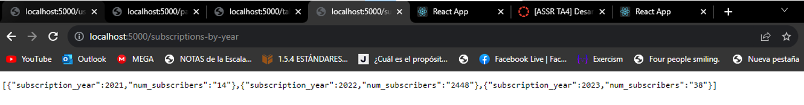
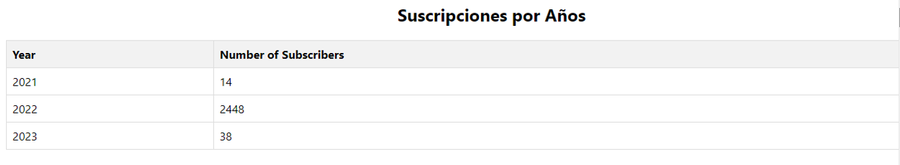
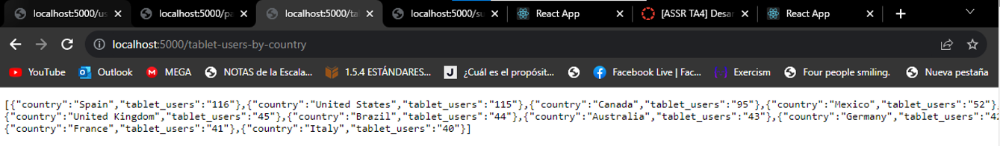
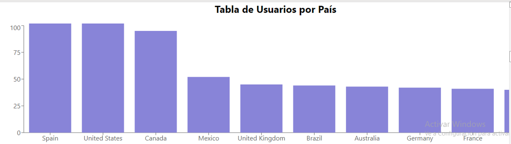
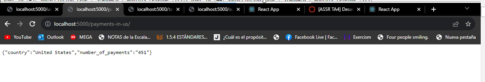
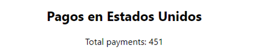
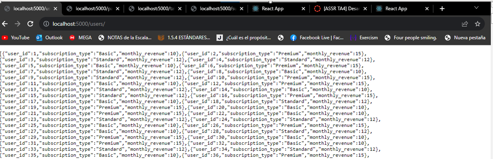
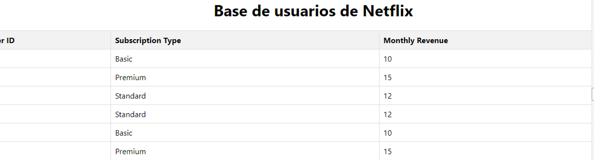

 ### Administración de Sistemas y Servicios en Red
- Profesora : Adriana Elisa Collaguazo Jaramillo

- Ayudante: Guillermo Zacarias Moreira Moreira

-  Integrantes : 
    - Angie Dayanna Tobar Alvarez
    - Héctor Andrés Bravo Castro 
    - César Eduardo Borja Paula
- Repositorio : [Github :) ](https://github.com/C3S4RB/TA4.git)

## Proceso de Creación de la Página Web

### Configuración Inicial:

 El proyecto consta de una carpeta "backend" para el servidor Node.js y una carpeta "client" para la parte del frontend.
### Backend (Node.js):

- El archivo `server.js` es el punto de entrada del servidor.
- Se importan los módulos necesarios como `express`, `body-parser`, `cors` y `pg` (PostgreSQL).
- Se configura el servidor y se establece el puerto en el que escuchará las solicitudes (5000 en este caso).
- Se configuran rutas para manejar diferentes tipos de solicitudes GET hacia la base de datos PostgreSQL y devolver los resultados en formato JSON.

### Frontend (React):

- El archivo `App.js` contiene el componente principal de la aplicación React.
- Se importan las bibliotecas necesarias de `recharts` para crear gráficos.
- Se establecen estados usando el hook `useState` para almacenar datos que serán recuperados del backend.
- Se utiliza el hook `useEffect` para realizar solicitudes GET a las rutas definidas en el backend y actualizar los estados con los datos recibidos.

### Presentación de Datos:

Los datos se presentan en diferentes secciones en la página web.

a. **Suscripciones por Año:**

- Los datos se presentan en una tabla simple con encabezados "Year" y "Number of Subscribers".
- Cada entrada se mapea a una fila en la tabla.

b. **Usuarios por País que Utilizan Tablets:**

- Se muestra una gráfica de barras utilizando `recharts`.
- La gráfica muestra el número de usuarios de tablet por país.
- El eje X muestra los países y el eje Y muestra el número de usuarios de tablet.
- Se utiliza el componente `ResponsiveContainer` para hacer que la gráfica sea sensible al tamaño de la pantalla.

c. **Pagos en Estados Unidos:**

- El total de pagos en Estados Unidos se muestra como un número.

d. **Base de Usuarios de Netflix:**

- Los datos se presentan en una tabla similar a la de "Suscripciones por Año".
- Cada entrada se mapea a una fila en la tabla.

### Estilos CSS:

- Los estilos CSS se utilizan para dar formato y presentación visual a la página web.
- Sin embargo, los estilos CSS no se proporcionan en el código que proporcionaste. Puedes agregar estilos para controlar la apariencia de los elementos HTML, como colores, fuentes, márgenes y más.
